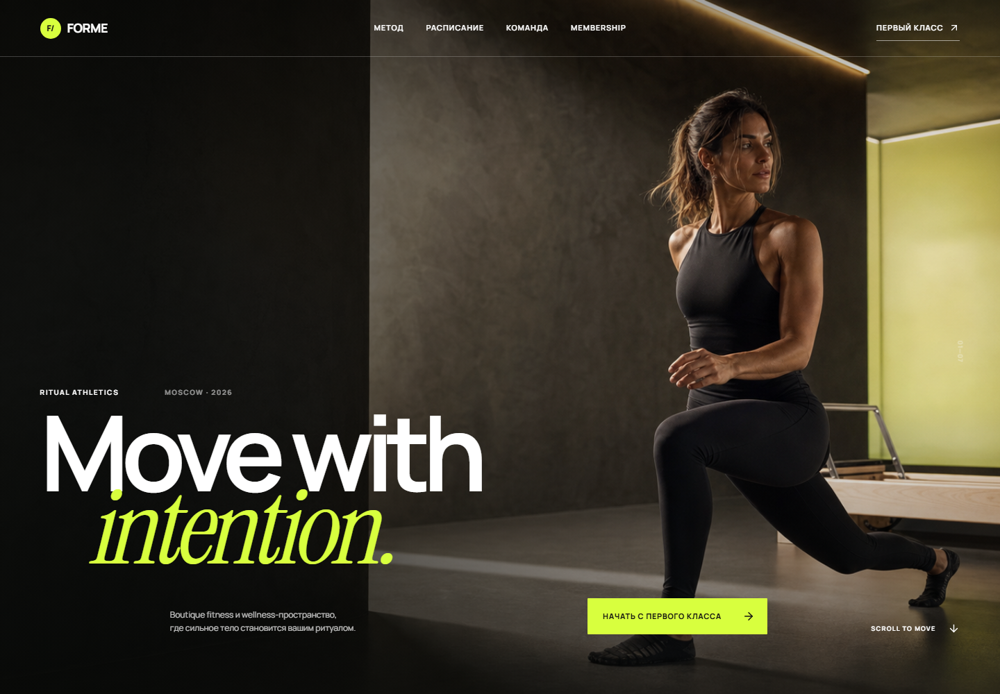

# FORME — premium fitness & wellness landing

Коммерческий лендинг вымышленного boutique fitness-клуба **FORME / Ritual Athletics**. Проект собран как портфолио-кейс: с полноценной брендовой подачей, фирменной фотосъёмкой, адаптивной editorial-сеткой, интерактивным расписанием и рабочей записью на пробный класс.



## Что реализовано

- выразительный hero с parallax/scroll-эффектом и motion typography;
- три направления с анимированными карточками и интерактивными CTA;
- расписание с выбором дня и фильтрацией по типу класса;
- блок тренеров, membership-планы, переключатель оплаты месяц/год;
- отзывы, lifestyle-галерея, статистика и финальный CTA;
- мобильное меню и адаптив от 320 px до широких desktop-экранов;
- поддержка `prefers-reduced-motion`;
- форма пробного занятия с клиентской и серверной валидацией;
- сохранение заявок через `POST /api/leads` в `data/leads.json`;
- success/error states, клавиатурное закрытие модального окна и базовая accessibility-разметка.

> По актуальному решению проекта админ-панель намеренно не включена.

## Стек

- Next.js 16 (App Router) / React 19 / TypeScript
- Framer Motion
- Zod
- Lucide React
- локальные variable fonts через Fontsource
- Next Image optimization

## Запуск

```bash
npm install
npm run dev
```

Откройте [http://localhost:3000](http://localhost:3000).

Production-проверка:

```bash
npm run lint
npm run build
npm start
```

## GitHub Pages

Для GitHub Pages проект собирается командой `STATIC_EXPORT=true npm run build`, после чего содержимое `out/` публикуется в ветку `gh-pages` с base path `/forme-ritual-athletics`. На Pages форма записи использует demo-fallback в `localStorage`; при обычном Node-запуске продолжает работать `POST /api/leads`.

## Заявки

Форма отправляет JSON в `POST /api/leads`. Сервер повторно проверяет поля через Zod и сохраняет валидную заявку в `data/leads.json` со служебными полями `id`, `status` и `createdAt`.

Файловое хранилище подходит для локального демо и single-instance Node deployment. Для реального production-развёртывания его следует заменить на PostgreSQL, Supabase или другую постоянную БД; клиентский контракт API при этом можно оставить прежним.

Пример payload:

```json
{
  "name": "Мария",
  "phone": "+7 999 000-00-00",
  "email": "maria@example.com",
  "program": "Reform / Pilates",
  "preferredTime": "Будни после 18:00",
  "consent": true
}
```

## Структура

```text
app/
  api/leads/route.ts   # серверная валидация и приём заявки
  globals.css          # дизайн-система, layout, responsive, motion
  layout.tsx
  page.tsx
components/
  Landing.tsx          # секции лендинга и основная интерактивность
  Schedule.tsx         # фильтруемое расписание
  TrialModal.tsx       # форма и состояния отправки
data/leads.json        # локальное mock-хранилище
lib/
  content.ts           # контент программ, классов и планов
  leads.ts             # слой хранения заявок
  types.ts
public/images/         # фирменные campaign-визуалы
```

## Визуальная система

Палитра строится на тёплом bone, graphite black и акцентном electric citron. Заголовки сочетают нейтральный Manrope с редакционным Instrument Serif. Все четыре campaign-изображения сгенерированы специально для FORME в единой арт-дирекции и хранятся локально в `public/images`.

## Важное для deployment

- среда должна разрешать запись в `data/leads.json`;
- для serverless-хостинга подключите постоянную БД;
- изображения уже локальные, внешние CDN и ключи не требуются;
- секретов и обязательных environment variables в демо нет.
